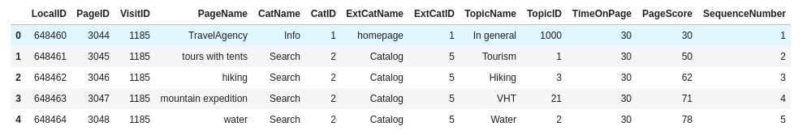
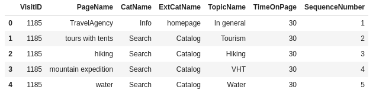
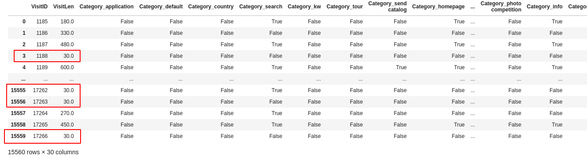
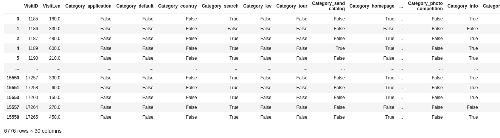
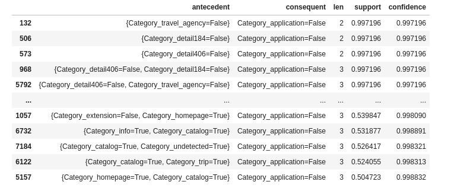
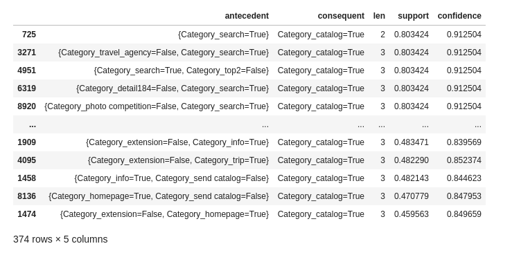
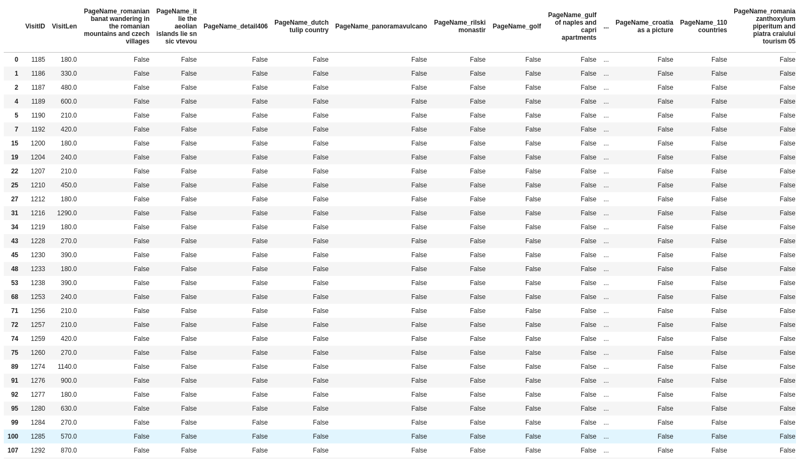
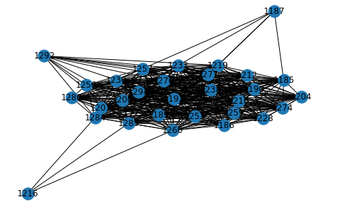
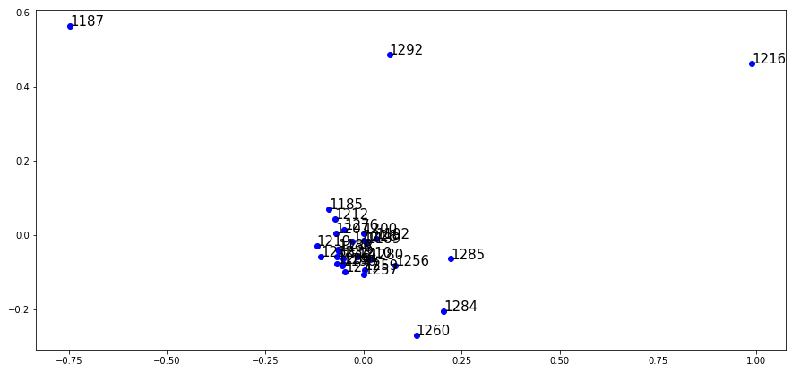

= HW4: Web Analytics/Web Usage Mining

== Run project

=== Create environment

[source, bash]
----
virtualenv ddw-pondepe1-hw-4
----

=== Activate environment

[source, bash]
----
source ddw-pondepe1-hw-4/bin/activate
----

=== Install requirements and run jupyter server

[source, bash]
----
./bin/run.sh
----

== Clean environment

=== Deactivate environment

[source, bash]
----
deactivate
----

=== Remove environment

[source, bash]
----
./bin/remove.sh
----

== Original dataset general statistics

=== Basic statistics

Visits (sessions) were computed by casting the `DataFrame` column into `set` type.

[source, python]
----
len(set(clicks['VisitID'].to_list()))
----

|===
| Statistic | Value

| Clicks | 38451
| Visits (sessions) | 15560
|===

=== Identified macro conversions

Macro conversions were identified by simple `DataFrame` filtration.

[source, python]
----
application_conv_df = clicks[(clicks['PageName'] == 'APPLICATION') | (clicks['CatName'] == 'APPLICATION') | (clicks['ExtCatName'] == 'APPLICATION')]
----

|===
| Type | Amount

| APPLICATION | 56
| CATALOG | 13842
|===

=== Identified micro conversions

Micro conversions were identifies similiarly to the macro conversions.

[source, python]
----
discount_conv_df = clicks[clicks['PageName'] == 'DISCOUNT']
----

|===
| Type | Amount

| DISCOUNT | 244
| HOWTOJOIN | 56
| INSURANCE | 45
| WHOWEARE | 266
|===

== Dataset preprocessing and cleaning

The dataset needed to be preprocessed before the data analysis.

=== Filter uninteresting columns from the dataset

I decided to remove the columns that won't be used in any performed analysis. These columns are `['LocalID', 'PageID', 'CatID', 'ExtCatID', 'TopicID', 'PageScore']`.

Below are data before and after this preprocessing step.

=== Removing short visits

Visits that are not longer than 30 seconds were removed from the dataset after the transformation into transaction-feature matrix described within the next section.

=== Transformation into transaction-feature matrix

The dataset was transformed into TFM where each row represents one visit and contains all the data needed for the analysis.

In order to perform the association rule analysis, the dataset `PageName`, `CatName` and `ExtCatName` columns values were binarized. Terms in the mentioned columns were transformed into lower case. This operation significantly increased number of dimensions. The final FTM had 855 columns.

Dimension of size 855 columns led to performance issues with Apriori algorithm. Based on that, I decided to binarize only the `CatName` and `ExtCatName` columns because the `PaneName` column added 825 columns into FTM dimension.

Now the short visits could be removed from the matrix using simple filter the the DataFrame.

[source, python]
----
visits_matrix = visits_matrix[visits_matrix['VisitLen'] > 30]
----

We can see that there are no matrix rows including visits with `VisitLen` shorter or equal to 30 seconds after performing the filter. Number of rows was decreased from 15660 to 6776.

== Visits statistics

We can check some statistics for visits FTM.

|===
| Statistic | Value

| Visits | 15560
| Visits longer than 30 s | 6776
|===

Decision of not including `PageName` column values into FTM caused that we are no longer able to track some conversions. In the table below, we can see amount of transactions leading to available conversions.

|===
| Conversion | Amount

| APPLICATION | 19
| CATALOG | 5444
| INSURANCE | 58
|===

== Association rule analysis

=== Application conversion as consequent

==== Apriori algorithm modification

During the analysis, I noticed that distribution of application consequent is strongly unbalanced, which is caused by the very small amount of transactions leading to the application conversion.

In order to be able to get at least some information about very rare `Category_application=True` consequents, I modified the Apriori algorithm to support both minimal and maximal support borders.

=== Associations not leading to APPLICATION conversion

Analysed association is equivalent to looking up for the `Category_application=False`  consequent in the association rules.

I configured the analysis according to the table below.

|===
| Attribute | value

| Itemset min support | 0.4
| Itemset max support | 1
| Itemset max length | 3
| Rule min confidence | 0.5
|===

Configuration in python source:

[source, python]
----
frequentItemsets, supports = apriori(dataset, 0.4, 1, 4)
rules = generateRules(frequentItemsets, supports, 0.5)
----

The `Category_application=False` consequents are very often, as we can see below.

=== Associations leading to APPLICATION conversion

Analysed association is equivalent to looking up for the `Category_application=True`  consequent in the association rules.

I found out that even modified Apriori algorithm doesn't lead to reasonable results. I still wasn't able to generate itemsets for this analysis.

The only result I was able to get is that there has to be a lot itemsets containing `Category_application=True` with support between 0.00014 and 0.00015 as Apriori wasn't able to finish in reasonable time with the following configuration.

[source, python]
----
frequentItemsets, supports = apriori(dataset, 0.00014, 0.00015, 2)
----

=== Associations leading to CATALOG conversion

I analysed transactions leading to CATALOG conversions.

Using the same configuration as during the `Category_application=False` analysis:

|===
| Attribute | value

| Itemset min support | 0.4
| Itemset max support | 1
| Itemset max length | 3
| Rule min confidence | 0.5
|===

We can see that for example a lot of search actions led to catalog conversion.

== Visits clustering analysis

The analysis was performed using `Node2Vec` library.

Based on the short research over the visits transaction-feature matrix containing only the categories dimensions, I decided to use transaction-feature matrix containing dimensions from binarized `PageName` column values. The main reason for this decision was high similarity between the visits.

Due to performance issues and outputs readability, there will be **only 30 records used in this analysis**.

=== Input DataFrame

Before the analysis, I filtered out visits shorter than 150 seconds. We can see the input dataframe snippet below.

=== Transforming DataFrame into graph

To be able to perform clustering using `Node2Vec`, the input DataFrame was transformed into Networkx graph `G` using following rules:

* For each visit there is a node in graph `G`
* For each visits `v1` and `v2` having at least 98.75% dimensions equal, there is an edge `(v1,v2)` in `G`

=== Similarity graph visualization

We can see visits `1187`, `1216` and `1292` having a small amount of edged compared to the rest of the graph.

=== Clustering vector space visualisation

We can see that visits mentioned in the previous section are separated from other visits. There are also three visits that are slightly separated from the main cluster.

== Issues during implementation

I had mainly performance issues during the implementation.

I had to analyze only category dimensions in the Association rule analysis due to much more unique values in PageName column.

Category led into similarity graph with too high density in the visits clustering analysis, so I used PageName dimensions and perform the analysis with 30 rows only.

== Ideas for extensions/improvements/future work

Performance issues should be solved in the future.

The analysis outputs could be used to optimize web structure to achieve more conversions.